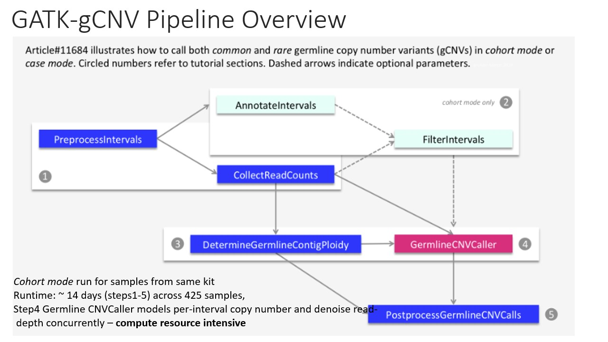
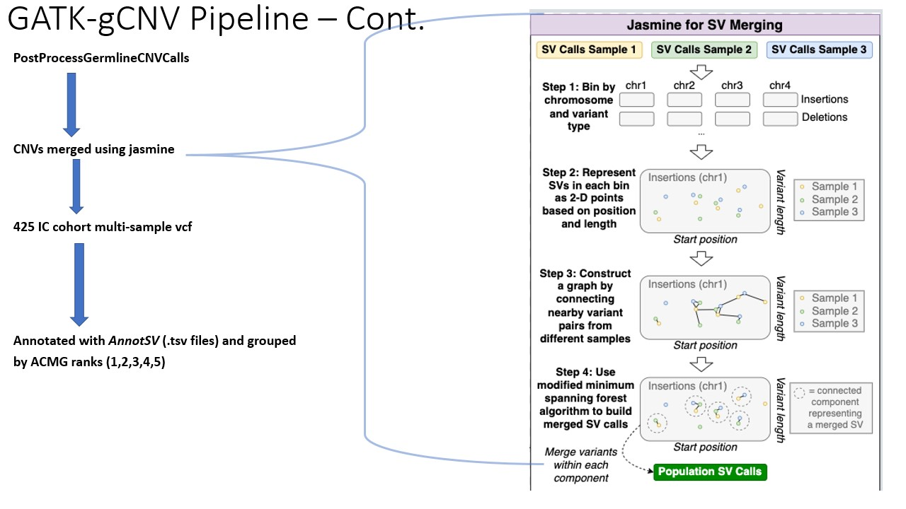
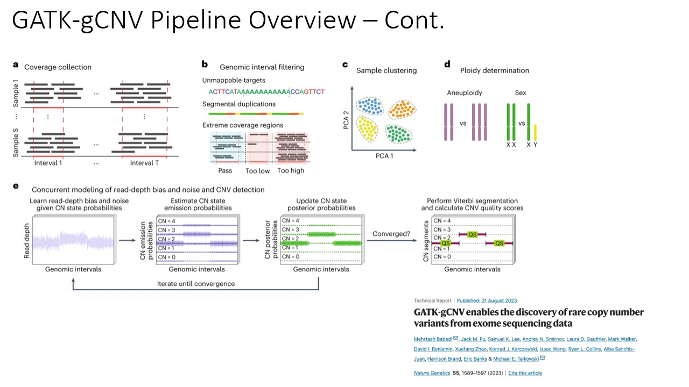

# Copy Number Variant Analysis using GATK-gCNV pipeline on 425 Interstitial Cystitis samples

## Overview
This repository contains scripts and resources for Copy Number Variant (CNV) analysis on and Interstitial Cystitis Cohort (n=425) using the Genome Analysis Toolkit's germline CNV (GATK-gCNV) pipeline.
The GATK-gCNV pipeline could be used for other datasets.

  



## Repository Structure
- `README.md`: This file, containing detailed information about the project.
- `scripts/`: Directory containing scripts used in the GATK-gCNV pipeline.
- `tx-6278_IC/`: Directory containing specific resources and datasets and analysis(could be partial for lack of space on github) related to the Interstitial Cohort Project

## How the Pipeline was run
This section will provide step-by-step instructions on how to run the GATK-gCNV pipeline for CNV analysis. Some examples maybe given only one of
the kits used, it should be simple to extend the logic to other kits.

### 1. Run PreprocessIntervals to convert exomeKit bed file to interval_list file (with 250bp padding)
`bash scripts/PreprocessIntervals.sh tx-6278_IC/data/IDT_xGen_Exome_Research_Panel_v1_all.bed`

`bash scripts/PreprocessIntervals.1.sh tx-6278_IC/data/Agilent_SureSelect_v6_all.bed`

e.g. Agilent_SureSelect_v6_all.bed.targets.preprocessed.interval_list will be the output. This uses GATK PreprocessIntervals to convert from a bed file to interval file.

### 2. CollectReadCounts and store read counts in hdf5 format

SGE cluster run.
tx-6278_IC/IC_proband_and_affected.ATAV_CRAMS.symLinks.txt is a file containing paths to cram/bam

qsub -S /bin/bash -cwd -V -N collectCountsExome -m bea -tc 240 -o . -e . -pe threaded 8 -t 1-1 scripts/CollectReadCounts.2.sh tx-6278_IC/IC_proband_and_affected.ATAV_CRAMS.symLinks.txt data/Agilent_SureSelect_v6_all.bed.targets.preprocessed.interval_list

- Given paths to crams, this uses GATK CollectReadCounts to read in BAM/CRAM and writes read counts. hdfa is the extension for files with read counts. 


### 3. Determine GermlineContigPloidy based on contig ploidy priors.

tx-6278_IC/PathToCounts.IDTERPv2.IC_proband_and_affected.txt contains path to hdf5CountsFile/sample generated in step2.

`bash scripts/DetermineGermlineContigPloidy.4.sh tx-6278_IC/PathToCounts.IDTERPv2.IC_proband_and_affected.txt data/IDTERPv2_all.bed.targets.preprocessed.interval_list`

HPC cluster sge mode run

`qsub -S /bin/bash -cwd -V -N DetermineGermlineContigPloidy -m bea -o . -e . -pe threaded 24 scripts/DetermineGermlineContigPloidy.4.sh tx-6278_IC/PathToCounts.agilentV6.IC_proband_and_affected.txt data/Agilent_SureSelect_v6_all.bed.targets.preprocessed.interval_list`

- uses GATK DetermineGermlineContigPloidy to determine ploidy for every sample
- creates contig ploidy

### 4. Scatter Files creation

- TODO: AYAN TO FILL IN THIS PART. 
- in step 3, creates ploidy calls. agilent 325. then providing path to count files. 
- input: path to counts file, contig file for human genome
- divide list of samples into small chunks. divide into 10 sample batches (e.g., 30 files per batch, for each batch contianing 30 samples, run on a cluster for all of the "contigs" or chromosome). Alternatively, parallelize over chromosome 1. 
- "scatter files" refers to what is being parallelized.

### 5. GermlineCNVCallerCohort Mode (rate limiting step. takes about a week)

`qsub -S /bin/bash -cwd -V -N GermlineCNVCallerCohort -m bea -tc 240 -o . -e . -pe threaded 24 -t 1-24 scripts/GermlineCNVCaller.5.sh tx-6278_IC/PathToCounts.agilentV6.IC_proband_and_affected.txt tx-6278_IC/Agilent325/scatter_file_list.Agilent325.txt ploidy-calls Agilent325Cohort`

- uses GATK GermlineCNVCaller.
- input: paths to counts (on the order of megabytes)
- way to run in different chunks. AYAN to post the scatter file list example. in this case, 1 - 24 means parallelizing by chromosome.
- TODO: we think ploidy-calls is the directory holding the output from step 3 but ploidy-calls is not mentioned in step 3. Ayan will clarify. 
- training gCNV. This outputs multiple metrics and model

### 6. PostprocessGermlineCNVCalls

`seq 1 325 | while read -r sample_indx; 
do 
  export SGE_TASK_ID=${sample_indx}; 
  bash scripts/PostprocessGermlineCNVCalls.6.sh tx-6278_IC/PathToCounts.agilentV6.IC_proband_and_affected.txt ploidy-calls 24; 
done`

- uses GATK PostprocessGermlineCNVCalls. take path to counts files (from step 2) and ploidy calls (output of step 3)
- get CNVs for every sample.
- output: VCF generated per sample (325 samples)

### Merging VCFs across samples to get multi-sample vcf(https://github.com/mkirsche/Jasmine)


## Requirements
- gatk-4.4.0.0 https://github.com/broadinstitute/gatk/releases/download/4.4.0.0/gatk-4.4.0.0.zip
- java17 https://www.oracle.com/java/technologies/javase/jdk17-archive-downloads.html
- samtools Version: 1.10 (using htslib 1.10)
- bcftools Version: 1.10 (using htslib 1.10)
- Jasmine version 1.1.5
- AnnotSV 3.3.6

*Fill in the details of the software, tools, and any other requirements needed to run your pipeline.*

- TODO: AYAN TO DO THIS BY 3/15

## Usage
```bash
# Example command to run the pipeline
# Replace with actual commands and provide necessary explanations
